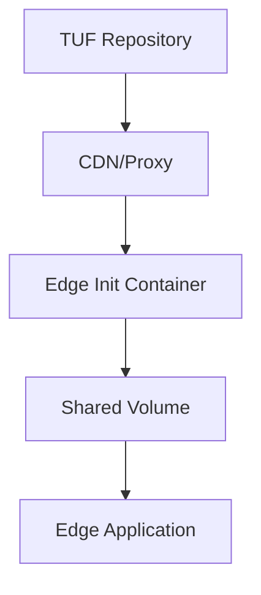

# TUF Golang Project - Educational Demo with Over-the-Air Updates

This is a comprehensive demonstration of The Update Framework (TUF) concepts using Go, including **over-the-air updates via network**. This project shows how to:

1. Create TUF repository metadata structure 
2. Demonstrate TUF roles and their relationships
3. Show secure file verification workflow
4. **Serve TUF repository over HTTP for network access**
5. **Implement over-the-air updates with network clients**
6. Understand TUF security guarantees

> **Note**: This is an educational demonstration using basic Go structures. For production use, you should use the official [go-tuf v2 library](https://github.com/theupdateframework/go-tuf).

## What is TUF?

The Update Framework (TUF) is a framework for securing software update systems. It provides:

- **Compromise resilience**: Multiple keys and roles prevent single points of failure
- **Integrity protection**: Cryptographic signatures ensure files haven't been tampered with
- **Freshness guarantees**: Timestamps prevent rollback attacks
- **Minimized trust**: Separation of concerns across different roles

## Project Structure

```
tuf-golang-project/
├── go.mod              # Go module definition (no external dependencies!)
├── cmd/                # Main applications (following Go project layout)
│   ├── tuf-demo/       # Repository setup and metadata creation
│   ├── tuf-client-demo/    # Local TUF client example
│   ├── tuf-server-demo/    # 🌐 HTTP server for network access
│   ├── network-client-demo/ # 🌐 Network client for over-the-air updates
│   └── add-targets-demo/   # Script to add additional targets
├── pkg/                # Public library code
│   └── tuf/            # TUF types and structures
├── internal/           # Private application code
│   ├── client/         # Client implementation
│   ├── server/         # Server implementation
│   └── tuf/            # TUF repository logic
├── api/                # API definitions
├── docs/               # 📋 Architecture documentation for edge containers
│   ├── architecture/   # Edge deployment architecture and security model
│   ├── diagrams/       # System architecture diagrams (Mermaid)
│   └── examples/       # Kubernetes and Docker Compose examples
├── README.md           # This comprehensive guide
├── Makefile            # Build and run commands
├── .gitignore          # Git ignore rules
├── tuf-repository/     # TUF repository (created when running tuf-demo)
│   ├── metadata/       # TUF metadata files (served over HTTP)
│   └── targets/        # Target files (served over HTTP)
├── client-cache/       # Local client cache directory
└── network-client-cache/ # Network client cache directory
```

## Prerequisites

- Go 1.24 or later
- Podman and Podman Compose (for containerized deployment)
- Internet connection for downloading dependencies

## Getting Started

### 💻 Local Development (Educational)

1. **Initialize the project:**
   ```bash
   cd tuf-golang-project
   # No dependencies needed - uses Go standard library only!
   ```

2. **Create the TUF repository:**
   ```bash
   go run main.go
   ```
   This creates TUF metadata structure and a sample target file.

3. **Test local TUF client:**
   ```bash
   go run client.go
   ```
   This demonstrates the TUF verification workflow locally.

4. **Add more targets (optional):**
   ```bash
   go run add_targets.go
   ```
   This adds more example files and updates the targets metadata.

### 🌐 Network/Over-the-Air Updates

1. **Initialize the project:**

   ```bash
   cd tuf-golang-project
   # No dependencies needed - uses Go standard library only!
   ```

2. **Create the TUF repository:**

   ```bash
   go run main.go
   ```

   This creates TUF metadata structure and a sample target file.

3. **Start the TUF repository server:**

   ```bash
   go run server.go
   # Server runs on http://localhost:8080
   # View web interface at http://localhost:8080
   ```

4. **Test over-the-air updates:**

   ```bash
   # In another terminal
   go run network-client.go
   ```

   This demonstrates secure network updates!

### 🐳 Containerized Deployment

Run the entire TUF system using Podman containers:

```bash
# Build and run all services with Podman Compose
cd build/package
podman-compose up --build

# Or run specific services
podman-compose up tuf-server  # Just the server
podman-compose up network-client  # Just the network client
```

The containerized setup includes:
- **tuf-init**: Initializes the TUF repository
- **add-targets**: Adds additional target files
- **tuf-server**: HTTP server on port 8080
- **network-client**: Demonstrates over-the-air updates
- **tuf-client**: Local client demo

### 🚀 Quick Test (Automated)

```bash
# Test the complete workflow automatically (local)
make test-ota

# Test using containers
cd build/package && podman-compose up --build
```

### 🌍 Network Access Options

```bash
# Local network access
go run server.go --port 8080
go run network-client.go --server http://localhost:8080

# Custom configurations
go run server.go --repo ./my-repo --port 9000

go run network-client.go --server http://my-server.com:8080 --cache ./my-cache
```

## TUF Roles Explained

- **Root**: The root of trust, signs other role metadata
- **Targets**: Defines which files are available and their metadata
- **Snapshot**: References specific versions of targets and other metadata
- **Timestamp**: Provides freshness guarantees for the snapshot

## Key Features Demonstrated

1. **TUF Metadata Structure**: Shows all four TUF roles and their relationships
2. **File Integrity**: Demonstrates how TUF tracks file sizes and hashes  
3. **Version Management**: Shows how metadata versions prevent rollback attacks
4. **Security Model**: Explains the multi-role security architecture
5. **Verification Workflow**: Step-by-step client verification process
6. **🌐 Network Distribution**: HTTP server for over-the-air updates
7. **📱 Client Updates**: Network client with automatic verification

## Use Cases Demonstrated

- **📱 Mobile Apps**: Background content and configuration updates
- **🌐 IoT Devices**: Secure firmware and software updates  
- **🖥️ Desktop Apps**: Plugin and asset updates
- **🐳 Containers**: Secure image and layer distribution
- **🎮 Gaming**: Game assets and patch distribution
- **⚙️ Config Management**: Secure configuration distribution

## Security Benefits

- **Integrity**: All files are cryptographically signed and verified
- **Authenticity**: Signatures verify the source of files
- **Freshness**: Timestamps prevent replay attacks
- **Availability**: Multiple signature thresholds provide resilience
- **🌐 Network Security**: HTTPS support and secure distribution
- **🔒 Attack Prevention**: Protection against various supply chain attacks

## 🚀 Production Deployment

For production over-the-air updates, see the **Production Deployment Guide** section below which covers:

- 🌍 **Cloud deployment** (AWS, DigitalOcean, etc.)
- 🔒 **HTTPS/TLS setup** with Let's Encrypt
- 📊 **Monitoring and logging**
- 🐳 **Docker deployment**
- 🌐 **CDN integration** for global distribution
- 🛡️ **Security hardening**

## Next Steps

To extend this project, you could:

1. Add multiple target files with different content types
2. Implement proper cryptographic key generation and rotation
3. Add delegation for distributed signing
4. Implement custom metadata for application-specific needs
5. Add rate limiting and advanced security features
6. Integrate with CI/CD pipelines for automated updates

---

# 🏗️ Edge Container Architecture

This project includes a comprehensive **edge container architecture** that demonstrates how to securely distribute files to edge containers using TUF with init container patterns.

## 📋 Architecture Documentation

Comprehensive documentation is available in the [`/docs`](./docs/) directory:

- **[Edge Deployment Architecture](./docs/architecture/edge-deployment.md)**: Main architecture overview
- **[Security Model](./docs/architecture/security-model.md)**: Security design and threat model
- **[Deployment Patterns](./docs/architecture/deployment-patterns.md)**: Various deployment patterns
- **[System Diagrams](./docs/diagrams/)**: Architecture diagrams using Mermaid

## 🎯 Edge Use Cases

The architecture supports various edge computing scenarios:

- **🌐 IoT Edge Devices**: Resource-constrained devices with intermittent connectivity
- **⚡ Edge Computing Nodes**: High-performance edge clusters with multiple applications  
- **📡 CDN Edge Servers**: Content delivery networks requiring frequent updates
- **🔒 Air-gapped Environments**: Secure facilities with no external network access

## 🚀 Quick Start - Edge Deployment

### Build Edge Init Container
```bash
# Build the specialized edge init container
podman build -f build/package/Dockerfile.edge-init -t tuf-edge-init:latest .
```

### Run Edge Stack
```bash
# Start complete edge development environment
cd docs/examples/docker-compose
podman-compose -f edge-stack.yml up --build
```

### Deploy to Kubernetes
```bash
# Deploy production edge architecture
kubectl apply -f docs/examples/kubernetes/edge-deployment.yaml
```

## 🔐 Edge Security Features

- **Init Container Pattern**: Secure file verification before application starts
- **Cryptographic Verification**: Ed25519/RSA signatures on all files
- **Zero Trust**: All files verified regardless of transport security
- **Container Security**: Read-only filesystems, non-root users, minimal privileges

## 📊 Architecture Overview



The edge architecture uses an **init container pattern** where:
1. Edge containers start with a TUF init container
2. Init container downloads and verifies files from TUF repository  
3. Files are shared with main application via volumes
4. Application uses pre-verified, tamper-proof files

📖 **[Read the complete architecture documentation →](./docs/README.md)**

---

# 🐳 Containerized Deployment Guide

This section covers deploying the TUF repository using Docker containers, following the `/build` directory structure.

## Container Architecture

All containerized deployment files are located under `/build/package/`:

```
build/
├── package/
│   ├── Dockerfile.tuf-demo          # TUF repository initialization
│   ├── Dockerfile.tuf-server        # TUF HTTP server
│   ├── Dockerfile.tuf-client        # Local TUF client demo
│   ├── Dockerfile.network-client    # Network TUF client
│   ├── Dockerfile.add-targets       # Utility to add more targets
│   └── docker-compose.yml           # Complete orchestration
└── ci/                              # CI/CD configurations (future)
```

## Quick Start with Docker Compose

```bash
# Navigate to the package directory
cd build/package

# Build and run the entire TUF ecosystem
docker-compose up --build

# View the TUF server web interface
open http://localhost:8080
```

## Individual Container Usage

### TUF Repository Server

```bash
# Build the server container
docker build -f build/package/Dockerfile.tuf-server -t tuf-server .

# Run with persistent storage
docker run -d \
  --name tuf-server \
  -p 8080:8080 \
  -v tuf-repository:/app/tuf-repository \
  tuf-server
```

### Network TUF Client

```bash
# Build the network client
docker build -f build/package/Dockerfile.network-client -t tuf-network-client .

# Run the client (connects to server)
docker run --rm \
  --name tuf-client \
  --link tuf-server:tuf-server \
  -v network-client-cache:/app/network-client-cache \
  tuf-network-client
```

### Repository Initialization

```bash
# Initialize repository in a container
docker build -f build/package/Dockerfile.tuf-demo -t tuf-init .
docker run --rm -v tuf-repository:/app/tuf-repository tuf-init

# Add additional targets
docker build -f build/package/Dockerfile.add-targets -t tuf-add-targets .
docker run --rm -v tuf-repository:/app/tuf-repository tuf-add-targets
```

## Production Container Deployment

### Using Docker Swarm

```yaml
# docker-stack.yml
version: '3.8'
services:
  tuf-server:
    image: your-registry/tuf-server:latest
    ports:
      - "8080:8080"
    volumes:
      - tuf-data:/app/tuf-repository
    deploy:
      replicas: 3
      update_config:
        parallelism: 1
        delay: 10s
      restart_policy:
        condition: on-failure
        delay: 5s
        max_attempts: 3

volumes:
  tuf-data:
    driver: local
```

```bash
# Deploy to Docker Swarm
docker stack deploy -c docker-stack.yml tuf-stack
```

### Using Kubernetes

```yaml
# k8s-deployment.yml
apiVersion: apps/v1
kind: Deployment
metadata:
  name: tuf-server
spec:
  replicas: 3
  selector:
    matchLabels:
      app: tuf-server
  template:
    metadata:
      labels:
        app: tuf-server
    spec:
      containers:
      - name: tuf-server
        image: your-registry/tuf-server:latest
        ports:
        - containerPort: 8080
        volumeMounts:
        - name: tuf-storage
          mountPath: /app/tuf-repository
      volumes:
      - name: tuf-storage
        persistentVolumeClaim:
          claimName: tuf-pvc
---
apiVersion: v1
kind: Service
metadata:
  name: tuf-server-service
spec:
  selector:
    app: tuf-server
  ports:
  - port: 80
    targetPort: 8080
  type: LoadBalancer
```

## Container Security Best Practices

1. **Multi-stage builds**: All Dockerfiles use multi-stage builds to minimize attack surface
2. **Non-root user**: Containers run with minimal privileges
3. **Health checks**: Server containers include health check endpoints
4. **Secrets management**: Use Docker secrets or Kubernetes secrets for sensitive data
5. **Registry security**: Push to private registries with vulnerability scanning

## Monitoring and Logging

### Container Logs

```bash
# View logs from all services
docker-compose logs -f

# View specific service logs
docker-compose logs -f tuf-server
docker-compose logs -f network-client
```

### Health Monitoring

```bash
# Check container health
docker ps
docker-compose ps

# Manual health check
curl http://localhost:8080/health
```

---

# 🚀 Production Deployment Guide

This section covers deploying the TUF repository server for production over-the-air updates.

## 🌐 Network Deployment Options

### Option 1: Local Network Deployment

For internal networks or development teams:

```bash
# Start server on all interfaces
go run server.go --port 8080

# Clients connect using your IP
go run network-client.go --server http://localhost:8080
```

**Access from other devices:**
- Server: `http://localhost:8080`
- Find your IP: `ip addr show` (Linux) or `ifconfig` (macOS)

### Option 2: Cloud Deployment (Production)

#### Using a VPS (DigitalOcean, AWS, etc.)

1. **Deploy to server:**
   ```bash
   # Copy files to server
   scp -r tuf-golang-project user@your-server.com:/home/user/

   # SSH to server
   ssh user@your-server.com
   cd tuf-golang-project

   # Install Go and run
   sudo apt update && sudo apt install golang-go
   go run server.go --port 8080
   ```

2. **Configure firewall:**
   ```bash
   # Open port 8080
   sudo ufw allow 8080
   ```

3. **Use from clients:**
   ```bash
   go run network-client.go --server http://your-server.com:8080
   ```

#### Using Docker

Build and run:
```bash
docker build -t tuf-server .
docker run -p 8080:8080 tuf-server
```

go run network-client.go --server http://localhost:8081

### Option 3: Production Setup with HTTPS

#### Using Nginx Reverse Proxy

1. **Install Nginx:**
   ```bash
   sudo apt install nginx certbot python3-certbot-nginx
   ```

2. **Configure Nginx (`/etc/nginx/sites-available/tuf`):**
   ```nginx
   server {
       listen 80;
       server_name your-domain.com;
       
       location / {
           proxy_pass http://localhost:8080;
           proxy_set_header Host $host;
           proxy_set_header X-Real-IP $remote_addr;
           proxy_set_header X-Forwarded-For $proxy_add_x_forwarded_for;
           proxy_set_header X-Forwarded-Proto $scheme;
       }
   }
   ```

3. **Enable site and get SSL:**
   ```bash
   sudo ln -s /etc/nginx/sites-available/tuf /etc/nginx/sites-enabled/
   sudo nginx -t
   sudo systemctl reload nginx
   sudo certbot --nginx -d your-domain.com
   ```

4. **Clients use HTTPS:**
   ```bash
   go run network-client.go --server https://your-domain.com
   ```

## 🔧 Production Configuration

### Environment Variables

Create `.env` file (don't commit this):
```bash
TUF_PORT=8080
TUF_REPO_PATH=/var/lib/tuf-repository
TUF_LOG_LEVEL=info
TUF_RATE_LIMIT=100
```

### Systemd Service

Create `/etc/systemd/system/tuf-server.service`:
```ini
[Unit]
Description=TUF Repository Server
After=network.target

[Service]
Type=simple
User=tuf
WorkingDirectory=/opt/tuf-server
ExecStart=/opt/tuf-server/tuf-server --port 8080
Restart=always
RestartSec=5

[Install]
WantedBy=multi-user.target
```

Enable and start:
```bash
sudo systemctl enable tuf-server
sudo systemctl start tuf-server
sudo systemctl status tuf-server
```

### Security Hardening

1. **Rate Limiting:**
   - Use Nginx rate limiting
   - Implement API rate limits in application

2. **Monitoring:**
   ```bash
   # Monitor server health
   curl http://localhost:8080/health
   
   # Check logs
   sudo journalctl -u tuf-server -f
   ```

3. **Backup:**
   ```bash
   # Backup TUF repository
   tar -czf tuf-backup-$(date +%Y%m%d).tar.gz tuf-repository/
   ```

## 📱 Client Integration Examples

### Mobile Apps (React Native/Flutter)

```javascript
// React Native example
const updateApp = async () => {
  try {
    const response = await fetch('https://your-server.com/metadata/targets.json');
    const targets = await response.json();
    
    // Check for updates and download new files
    for (const [filename, info] of Object.entries(targets.targets)) {
      await downloadAndVerifyFile(filename, info);
    }
  } catch (error) {
    console.error('Update failed:', error);
  }
};
```

### IoT Devices

```bash
#!/bin/bash
# Simple bash client for IoT devices
SERVER="https://your-server.com"
curl -f "$SERVER/health" || exit 1
curl -f "$SERVER/metadata/targets.json" -o targets.json
# Parse and download files...
```

### Desktop Applications

```go
// Integrate into your Go application
client := NewNetworkTUFClient("https://your-server.com", "./app-cache")
if err := client.Update(); err != nil {
    log.Printf("Update failed: %v", err)
}
```

## 🛡️ Security Best Practices

### For Production:

1. **Use HTTPS everywhere**
2. **Implement proper TUF key management**
3. **Regular security audits**
4. **Monitor for suspicious activity**
5. **Keep dependencies updated**
6. **Use CDN for global distribution**

### TUF Security Features:

- ✅ **Integrity**: Files are cryptographically verified
- ✅ **Authenticity**: Metadata is signed by trusted keys
- ✅ **Freshness**: Timestamps prevent replay attacks
- ✅ **Consistency**: Snapshots ensure coordinated updates
- ✅ **Survivability**: Multiple keys prevent single points of failure

## 📊 Monitoring and Analytics

### Health Monitoring

```bash
# Check server status
curl -s http://localhost:8080/health | jq .

# Monitor update requests
tail -f /var/log/tuf-server.log
```

### Update Analytics

Track client updates:
- Number of clients
- Update success rates
- Geographic distribution
- Error patterns

## 🌍 Real-World Use Cases

1. **Mobile App Updates**: Background app content updates
2. **IoT Device Updates**: Firmware and configuration updates
3. **Desktop Software**: Plugin and content updates
4. **Container Updates**: Secure container image distribution
5. **Game Updates**: Game assets and patches
6. **Configuration Management**: Secure config distribution

## 🚨 Troubleshooting

### Common Issues:

1. **Server not accessible:**
   ```bash
   # Check if server is running
   netstat -tlnp | grep :8080
   
   # Check firewall
   sudo ufw status
   ```

2. **Client connection fails:**
   ```bash
   # Test connectivity
   curl -v http://your-server:8080/health
   ```

3. **Files not downloading:**
   - Check repository structure
   - Verify metadata integrity
   - Check server logs

### Debug Mode:

```bash
# Run server with verbose logging
go run server.go --port 8080 --debug

# Run client with debug output
go run network-client.go --server http://localhost:8080 --debug
```

## References

- [TUF Specification](https://theupdateframework.github.io/specification/latest/)
- [Go-TUF Library](https://github.com/theupdateframework/go-tuf)
- [TUF Documentation](https://theupdateframework.io/)
