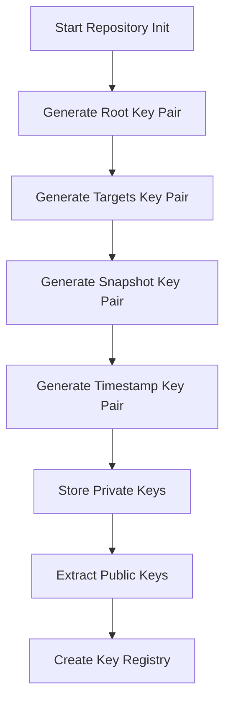
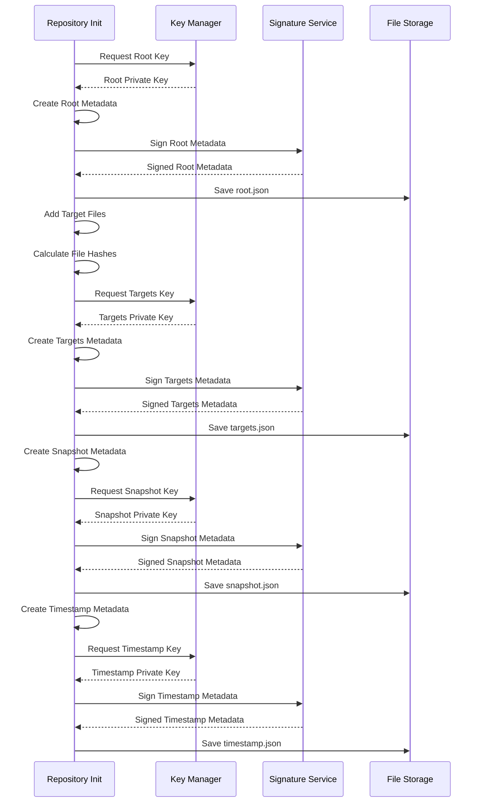
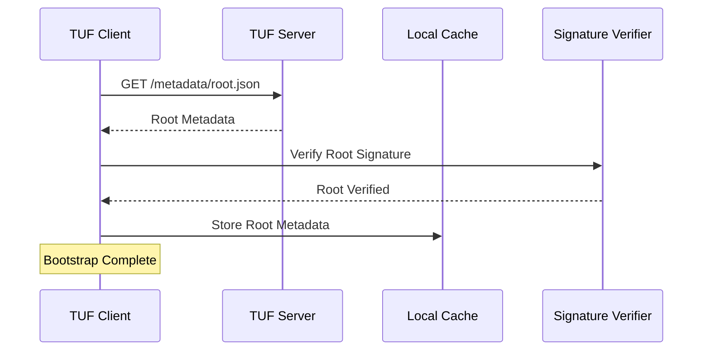
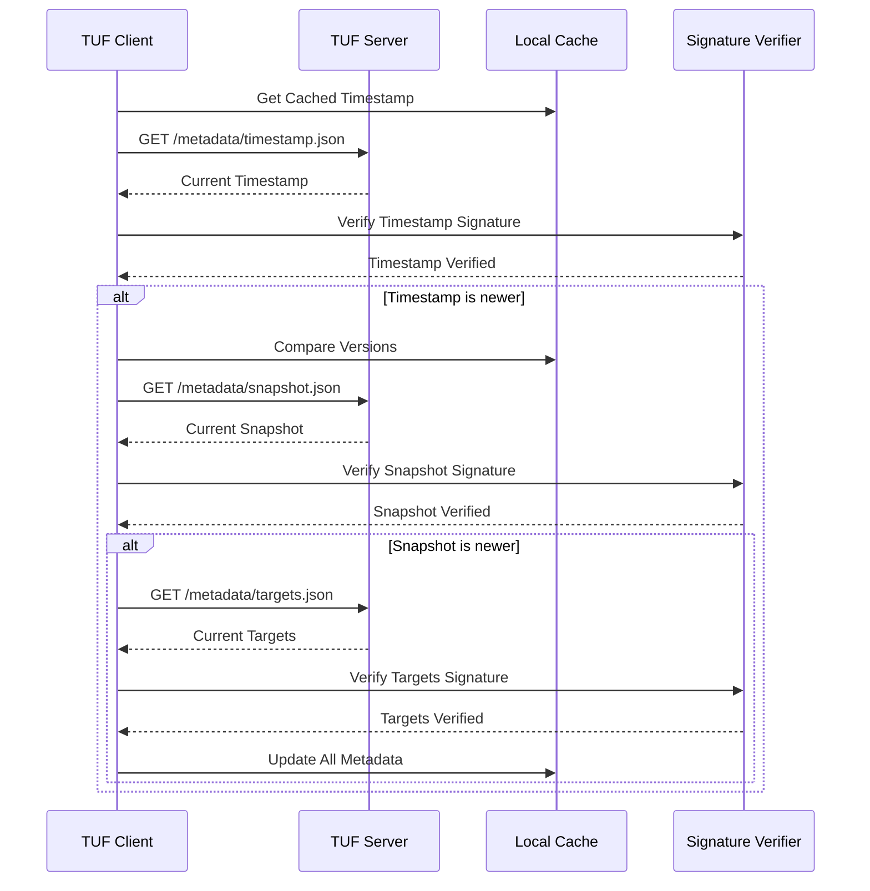
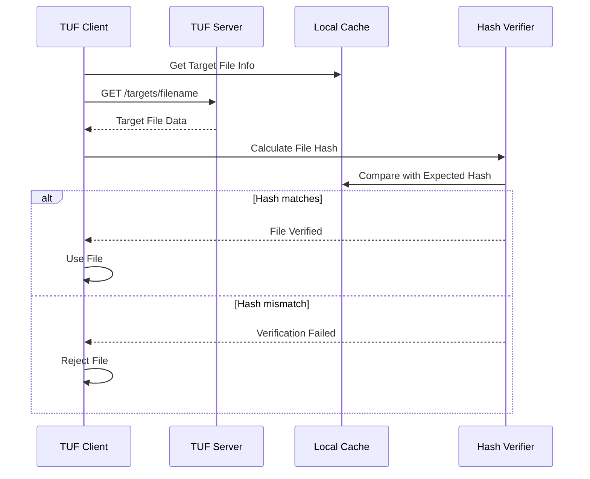
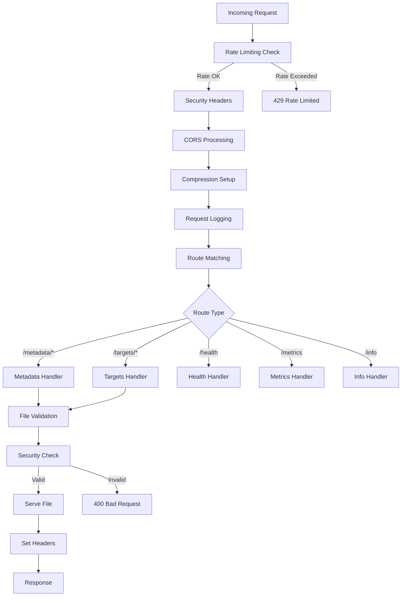
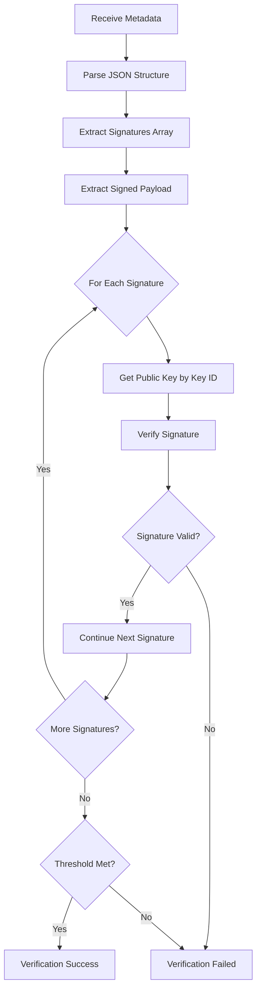
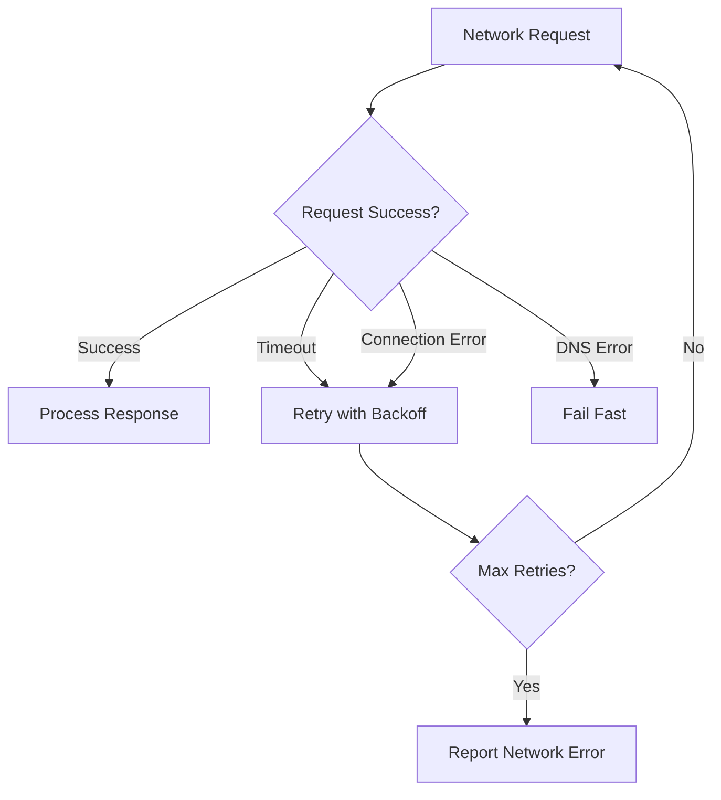

# TUF Data Flow Documentation

## Overview

This document describes the detailed data flow within the TUF (The Update Framework) system, covering repository initialization, client-server communication, and security verification processes.

## Repository Initialization Data Flow

### 1. Key Generation Phase

**Key Details:**
- **Algorithm**: Ed25519 for all key pairs
- **Storage**: Private keys in PEM format
- **Key IDs**: Hex-encoded public key for identification
- **Security**: Private keys should be stored securely (HSM in production)

### 2. Metadata Creation Flow

### 3. Target File Processing

**File Addition Flow:**
1. **File Placement**: Copy target file to `targets/` directory
2. **Hash Calculation**: Generate SHA256 hash of file content
3. **Size Recording**: Record exact file size in bytes
4. **Metadata Update**: Add file info to targets.json
5. **Signature**: Re-sign targets.json with targets key
6. **Cascade Update**: Update and re-sign snapshot.json and timestamp.json

## Client-Server Communication Flow

### 1. Client Bootstrap Process

### 2. Update Check Flow

### 3. File Download Flow

## Server Request Processing Flow

### 1. HTTP Request Pipeline

### 2. Metadata Serving Process

**Metadata Request Flow:**
1. **Path Extraction**: Extract metadata filename from URL
2. **Security Validation**: 
   - Check for `.json` extension
   - Prevent path traversal attacks (`..` sequences)
   - Validate filename characters
3. **File Location**: Construct file path in metadata directory
4. **File Existence**: Check if file exists on filesystem
5. **Content Type**: Set `application/json` content type
6. **Cache Headers**: Set appropriate cache TTL
7. **File Serving**: Stream file contents to client
8. **Access Logging**: Log request details and client IP

### 3. Target File Serving Process

**Target Request Flow:**
1. **Path Extraction**: Extract target filename from URL
2. **Security Validation**: Prevent path traversal attacks
3. **File Location**: Construct file path in targets directory
4. **Content Type Detection**: Determine MIME type from extension
5. **Cache Headers**: Set appropriate cache TTL
6. **File Streaming**: Serve file with proper headers
7. **Access Logging**: Log download activity

## Security Verification Data Flow

### 1. Signature Verification Process

### 2. Metadata Consistency Verification

**Consistency Check Flow:**
1. **Root Metadata**: Self-signed, defines all role keys
2. **Timestamp Check**: Verify timestamp is recent and signed by timestamp key
3. **Snapshot Verification**: Verify snapshot is signed by snapshot key
4. **Version Consistency**: Ensure snapshot lists current targets version
5. **Targets Verification**: Verify targets is signed by targets key
6. **Hash Verification**: Verify targets hash matches snapshot record

### 3. File Integrity Verification

**File Verification Process:**
1. **Metadata Lookup**: Find file entry in targets.json
2. **Hash Extraction**: Get expected SHA256 hash from metadata
3. **Size Extraction**: Get expected file size from metadata
4. **Download File**: Receive file data from server
5. **Hash Calculation**: Calculate SHA256 of received data
6. **Size Verification**: Verify received size matches expected
7. **Hash Comparison**: Compare calculated vs expected hash
8. **Accept/Reject**: Accept file if verification passes

## Error Handling Data Flow

### 1. Network Error Handling

### 2. Verification Error Handling

**Error Response Flow:**
1. **Signature Failure**: Log error, reject metadata, use cached version
2. **Hash Mismatch**: Log error, reject file, do not cache
3. **Expired Metadata**: Log warning, continue with grace period
4. **Missing Keys**: Log error, fail verification
5. **Malformed JSON**: Log error, reject metadata

### 3. Server Error Responses

**Error Response Types:**
- **400 Bad Request**: Invalid file paths, malformed requests
- **404 Not Found**: Missing metadata or target files
- **429 Too Many Requests**: Rate limiting exceeded
- **500 Internal Server Error**: Server-side processing errors
- **503 Service Unavailable**: Server overloaded or maintenance

## Performance Optimization Data Flow

### 1. Caching Strategy

**Cache Levels:**
1. **Client Cache**: Local metadata and file cache
2. **Server Cache**: File system cache for frequently accessed files
3. **HTTP Cache**: Browser/proxy caching with appropriate TTLs
4. **CDN Cache**: Geographic distribution of content

### 2. Compression Flow

**Compression Process:**
1. **Accept-Encoding Check**: Verify client supports gzip
2. **Content-Type Check**: Compress text-based content
3. **Size Threshold**: Only compress files above threshold
4. **Compression**: Apply gzip compression
5. **Headers**: Set Content-Encoding and Vary headers
6. **Streaming**: Stream compressed content to client

### 3. Connection Management

**Connection Optimization:**
1. **Keep-Alive**: Reuse HTTP connections
2. **Connection Pooling**: Maintain connection pools
3. **Timeout Management**: Appropriate timeouts for different operations
4. **Resource Limits**: Control concurrent connections and memory usage

## Monitoring and Observability Data Flow

### 1. Metrics Collection

**Metric Types:**
- **Request Metrics**: Count, duration, status codes
- **Performance Metrics**: Response times, throughput
- **Security Metrics**: Rate limit hits, blocked requests
- **System Metrics**: Memory usage, CPU usage, disk space

### 2. Logging Flow

**Log Data Flow:**
1. **Request Logging**: Log all incoming requests
2. **Security Logging**: Log security events and violations
3. **Error Logging**: Log all errors and exceptions
4. **Performance Logging**: Log slow requests and bottlenecks
5. **Structured Output**: JSON format for log aggregation
6. **Log Shipping**: Send logs to centralized logging system

### 3. Health Check Flow

**Health Check Process:**
1. **Repository Access**: Verify file system access
2. **Key Availability**: Check cryptographic key access
3. **Memory Status**: Check memory usage
4. **Disk Space**: Verify adequate storage
5. **Response Generation**: Generate health status JSON
6. **HTTP Response**: Return appropriate status code