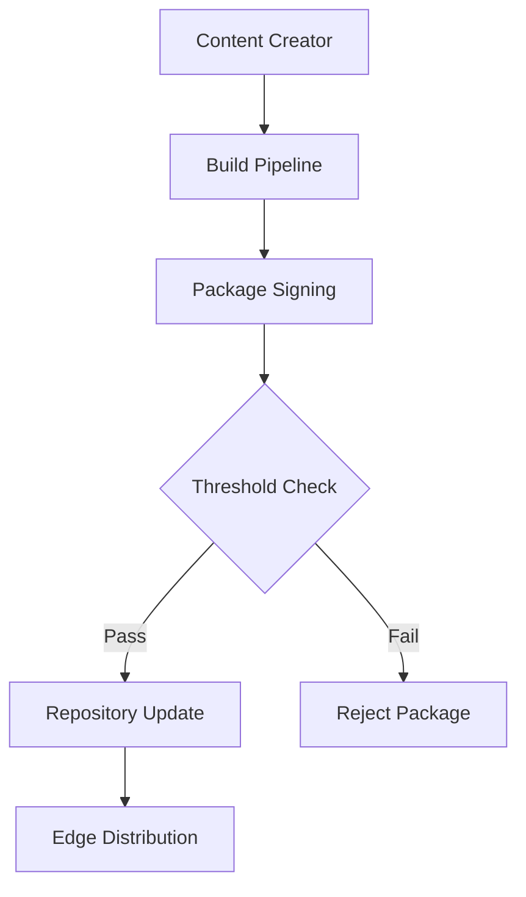

# TUF Edge Security Model

## Security Objectives

The TUF edge deployment architecture is designed to provide comprehensive security for file distribution to edge containers, protecting against a wide range of attacks while maintaining operational efficiency.

### Primary Security Goals

1. **Integrity**: Ensure files have not been tampered with in transit or at rest
2. **Authenticity**: Verify files originate from trusted sources
3. **Freshness**: Prevent rollback and replay attacks
4. **Availability**: Maintain service during security incidents
5. **Confidentiality**: Protect sensitive files during distribution

## Threat Model

### Assumptions

#### Trusted Components
- **Edge Container Runtime**: Assumes container runtime is secure
- **Init Container**: TUF init container code is trusted
- **Root Keys**: Initial root key distribution is secure
- **HSM/KMS**: Hardware security modules are tamper-resistant

#### Untrusted Components
- **Network Infrastructure**: All network communication is untrusted
- **CDN/Proxies**: Content distribution networks may be compromised
- **Repository Mirrors**: Mirror servers may be malicious
- **Local Storage**: Edge local storage may be compromised
- **DNS**: DNS resolution may be attacked

### Threat Categories

#### 1. Supply Chain Attacks

**Threat**: Malicious files injected into the distribution pipeline

**TUF Mitigation**:
- **Threshold Signatures**: Multiple signatures required for file authorization
- **Role Separation**: Different keys for different responsibilities
- **Offline Root Keys**: Root keys stored offline and rotated regularly



#### 2. Man-in-the-Middle Attacks

**Threat**: Attackers intercept and modify files during transmission

**TUF Mitigation**:
- **Cryptographic Signatures**: All metadata and targets signed
- **Snapshot Consistency**: Ensures consistent view of repository
- **Hash Verification**: File integrity verified with cryptographic hashes

#### 3. Rollback Attacks

**Threat**: Attackers serve outdated vulnerable files

**TUF Mitigation**:
- **Timestamp Metadata**: Monotonically increasing version numbers
- **Expiration Dates**: Metadata expires to prevent replay
- **Version Tracking**: Client tracks highest seen version

#### 4. Key Compromise

**Threat**: Signing keys are compromised by attackers

**TUF Mitigation**:
- **Key Rotation**: Automated key rotation schedules
- **Threshold Signatures**: Multiple keys required, partial compromise survivable
- **Root Key Recovery**: Secure root key recovery procedures

## Cryptographic Architecture

### Key Hierarchy

```
                    ┌─────────────────┐
                    │   Root Keys     │
                    │   (Offline)     │
                    │  Threshold: 3/5 │
                    └─────────┬───────┘
                              │
            ┌─────────────────┼─────────────────┐
            │                 │                 │
    ┌───────▼────────┐ ┌─────▼──────┐ ┌───────▼────────┐
    │  Targets Key   │ │ Snapshot   │ │  Timestamp     │
    │   (Online)     │ │    Key     │ │     Key        │
    │ Threshold: 2/3 │ │ (Online)   │ │   (Online)     │
    └────────────────┘ └────────────┘ └────────────────┘
            │
    ┌───────▼────────┐
    │ Delegated Keys │
    │  (Per-Region)  │
    │ Threshold: 1/2 │
    └────────────────┘
```

### Key Specifications

#### Root Keys
- **Algorithm**: Ed25519 or RSA-PSS 4096
- **Threshold**: 3 of 5 keys required
- **Storage**: Hardware Security Modules (HSM)
- **Rotation**: Annual or after compromise

#### Online Keys
- **Algorithm**: Ed25519 (preferred for performance)
- **Targets**: 2 of 3 threshold for high-value targets
- **Snapshot/Timestamp**: Single key with frequent rotation
- **Storage**: KMS with audit logging

#### Delegated Keys
- **Algorithm**: Ed25519
- **Scope**: Region or environment-specific
- **Threshold**: 1 of 2 for operational flexibility
- **Rotation**: Monthly or quarterly

### Signature Verification Process

```python
def verify_file_security(metadata_path, target_path):
    """
    Comprehensive file verification process
    """
    # 1. Verify root metadata signature
    root = load_and_verify_root(metadata_path)
    
    # 2. Verify timestamp freshness
    timestamp = load_and_verify_timestamp(root, metadata_path)
    if timestamp.expires < current_time():
        raise SecurityError("Timestamp expired")
    
    # 3. Verify snapshot consistency
    snapshot = load_and_verify_snapshot(root, timestamp, metadata_path)
    
    # 4. Verify targets metadata
    targets = load_and_verify_targets(root, snapshot, metadata_path)
    
    # 5. Verify target file
    target_info = targets.get_target_info(target_path)
    if not verify_file_hash(target_path, target_info.hashes):
        raise SecurityError("File hash verification failed")
    
    return True
```

## Edge Security Implementation

### Init Container Security

The TUF init container implements multiple security layers:

#### 1. Secure Bootstrap
```dockerfile
FROM alpine:latest AS builder
# Verify base image signatures
RUN apk add --no-cache ca-certificates
COPY --from=verify tuf-client /usr/local/bin/

FROM scratch
COPY --from=builder /etc/ssl/certs/ca-certificates.crt /etc/ssl/certs/
COPY --from=builder /usr/local/bin/tuf-client /tuf-client

# Run as non-root user
USER 65534:65534
ENTRYPOINT ["/tuf-client"]
```

#### 2. Runtime Security Controls
- **No Network Access**: After initial download, network access revoked
- **Read-Only Root**: Container filesystem mounted read-only
- **Minimal Privileges**: No escalated permissions required
- **Resource Limits**: CPU and memory constraints applied

#### 3. Verification Pipeline
```go
type EdgeVerifier struct {
    rootKeys    map[string]PublicKey
    cache       *FileCache
    httpClient  *http.Client
}

func (e *EdgeVerifier) VerifyAndDownload(targets []string) error {
    // Download and verify metadata chain
    metadata, err := e.downloadMetadata()
    if err != nil {
        return fmt.Errorf("metadata download failed: %w", err)
    }
    
    // Verify signature chain
    if err := e.verifySignatureChain(metadata); err != nil {
        return fmt.Errorf("signature verification failed: %w", err)
    }
    
    // Download and verify targets
    for _, target := range targets {
        if err := e.downloadAndVerifyTarget(target, metadata); err != nil {
            return fmt.Errorf("target verification failed: %w", err)
        }
    }
    
    return nil
}
```

### Secure File Handling

#### File Permissions
```yaml
targets:
  "config/app.conf":
    length: 1024
    hashes:
      sha256: "abc123..."
    custom:
      permissions: "0644"
      owner: "app:app"
      
  "secrets/database.key":
    length: 256
    hashes:
      sha256: "def456..."
    custom:
      permissions: "0600"
      owner: "app:app"
      sensitive: true
```

#### Secure Extraction
```go
func secureExtract(archivePath, destPath string, targetInfo TargetInfo) error {
    // Validate extraction path
    if !strings.HasPrefix(destPath, "/app/files/") {
        return errors.New("extraction path outside allowed directory")
    }
    
    // Check for path traversal
    cleanPath := filepath.Clean(destPath)
    if strings.Contains(cleanPath, "..") {
        return errors.New("path traversal detected")
    }
    
    // Verify file size limits
    if targetInfo.Length > maxFileSize {
        return errors.New("file size exceeds limit")
    }
    
    // Extract with security controls
    return extractWithLimits(archivePath, destPath, targetInfo)
}
```

## Network Security

### Transport Security

#### HTTPS/TLS Requirements
- **TLS Version**: TLS 1.3 minimum
- **Certificate Validation**: Full chain validation with pinning
- **Cipher Suites**: Strong ciphers only (AEAD)
- **HSTS**: HTTP Strict Transport Security enabled

#### Certificate Pinning
```go
type PinnedTransport struct {
    pins map[string][]byte
}

func (pt *PinnedTransport) RoundTrip(req *http.Request) (*http.Response, error) {
    // Perform TLS handshake
    conn, err := tls.Dial("tcp", req.URL.Host, &tls.Config{
        VerifyConnection: pt.verifyPin,
    })
    if err != nil {
        return nil, err
    }
    
    // Continue with request
    return http.DefaultTransport.RoundTrip(req)
}

func (pt *PinnedTransport) verifyPin(cs tls.ConnectionState) error {
    expectedPin := pt.pins[cs.ServerName]
    if expectedPin == nil {
        return errors.New("no pin configured for server")
    }
    
    for _, cert := range cs.PeerCertificates {
        pin := sha256.Sum256(cert.RawSubjectPublicKeyInfo)
        if bytes.Equal(pin[:], expectedPin) {
            return nil
        }
    }
    
    return errors.New("certificate pin validation failed")
}
```

### Network Segmentation

#### Container Network Policies
```yaml
apiVersion: networking.k8s.io/v1
kind: NetworkPolicy
metadata:
  name: tuf-edge-security
spec:
  podSelector:
    matchLabels:
      app: edge-application
  policyTypes:
  - Ingress
  - Egress
  egress:
  # Allow TUF repository access
  - to:
    - namespaceSelector:
        matchLabels:
          name: tuf-system
    ports:
    - protocol: TCP
      port: 443
  # Allow DNS resolution
  - to: []
    ports:
    - protocol: UDP
      port: 53
  # Block all other egress
  ingress:
  # Allow health checks only
  - from:
    - namespaceSelector:
        matchLabels:
          name: monitoring
    ports:
    - protocol: TCP
      port: 8080
```

## Compliance and Auditing

### Security Standards Compliance

#### NIST Cybersecurity Framework
- **Identify**: Asset inventory and risk assessment
- **Protect**: Access controls and data security
- **Detect**: Security monitoring and anomaly detection
- **Respond**: Incident response procedures
- **Recover**: Business continuity and disaster recovery

#### Common Criteria (ISO 15408)
- **Security Functional Requirements**: Authentication, authorization, audit
- **Security Assurance Requirements**: Development and evaluation standards
- **Protection Profiles**: Government and defense specifications

### Audit Logging

#### Security Event Logging
```json
{
  "timestamp": "2025-01-15T10:30:00Z",
  "severity": "WARNING",
  "component": "tuf-edge-init",
  "event_type": "signature_verification_failed",
  "edge_location": "us-west-2-edge-01",
  "file": "critical-update-v2.1.0.tgz",
  "expected_hash": "sha256:abc123...",
  "actual_hash": "sha256:def456...",
  "source_ip": "203.0.113.1",
  "user_agent": "tuf-client/1.0.0",
  "remediation": "file_rejected"
}
```

#### Compliance Reporting
- **Monthly Security Reports**: Key rotation, threat detections, incidents
- **Annual Security Assessments**: Penetration testing, vulnerability scans
- **Real-time Alerts**: Critical security events, policy violations
- **Audit Trails**: Complete chain of custody for all file distributions

## Incident Response

### Security Incident Types

#### 1. Key Compromise
**Response Procedure**:
1. Immediately revoke compromised keys
2. Generate new keys with updated threshold
3. Re-sign all affected metadata
4. Notify all edge locations of key update
5. Monitor for unauthorized file distributions

#### 2. Signature Verification Failures
**Response Procedure**:
1. Quarantine affected files
2. Alert security operations center
3. Investigate root cause (corruption vs. attack)
4. Re-verify file integrity from source
5. Update security monitoring rules

#### 3. Timestamp Expiration
**Response Procedure**:
1. Check for network connectivity issues
2. Verify timestamp server availability
3. Generate fresh timestamp metadata
4. Update repository with new timestamps
5. Resume edge container deployments

### Recovery Procedures

#### Emergency Key Recovery
```bash
#!/bin/bash
# Emergency root key recovery procedure

# 1. Assemble key holders (3 of 5 required)
echo "Initiating emergency key recovery..."

# 2. Generate new root keys
tuf-keygen --algorithm ed25519 --output new-root.key

# 3. Create new root metadata
tuf-root-metadata --keys new-root.key --threshold 3 --expires +1y

# 4. Sign with old root keys (if available)
tuf-sign --key old-root.key new-root.json

# 5. Distribute new root to edge locations
kubectl create configmap tuf-root-keys --from-file=new-root.json
```

#### File Integrity Recovery
```bash
#!/bin/bash
# Recover from file corruption

# 1. Identify corrupted files
corrupted_files=$(tuf-verify --check-all --report-failures)

# 2. Re-download from source
for file in $corrupted_files; do
    tuf-download --verify --file "$file" --force-refresh
done

# 3. Update local cache
tuf-cache --rebuild --verify-all

# 4. Restart affected services
kubectl rollout restart deployment edge-applications
```

## Security Testing and Validation

### Automated Security Testing

#### Vulnerability Scanning
```yaml
# Security scanning pipeline
security_scan:
  stage: test
  image: aquasec/trivy:latest
  script:
    - trivy image --exit-code 1 tuf-edge-init:latest
    - trivy fs --exit-code 1 ./docs/architecture/
  artifacts:
    reports:
      container_scanning: trivy-report.json
```

#### Penetration Testing Scenarios
1. **Network Attacks**: Man-in-the-middle, DNS poisoning
2. **Cryptographic Attacks**: Key extraction, signature forgery
3. **Container Escapes**: Privilege escalation, resource exhaustion
4. **Supply Chain**: Malicious package injection, dependency confusion

### Security Metrics

#### Key Performance Indicators
- **Signature Verification Success Rate**: >99.9%
- **Key Rotation Frequency**: Monthly for online keys
- **Incident Response Time**: <15 minutes for critical issues
- **Certificate Expiration Monitoring**: 30-day advance warning
- **Security Scan Coverage**: 100% of container images

#### Monitoring Dashboards
```prometheus
# Security metrics collection
signature_verifications_total{status="success|failure"}
key_rotation_days_since_last{key_type="root|targets|timestamp"}
security_incidents_total{severity="low|medium|high|critical"}
file_integrity_checks_total{result="pass|fail"}
```

This security model provides defense-in-depth protection for the TUF edge deployment architecture, ensuring robust security while maintaining operational efficiency.